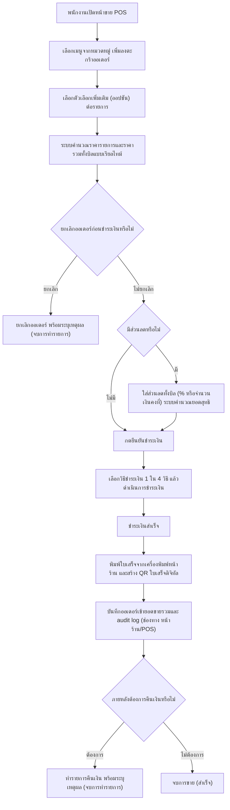

# User Journey: พนักงาน (staff) - การขายหน้าร้านผ่าน POS

> สร้างเมื่อ: 2026-08-15
> อ้างอิงจาก: [[../../01-requirements/01-spec/20260815-01-pos-point-of-sale|20260815-01-pos-point-of-sale]]

## Actor

พนักงานหน้าเคาน์เตอร์ที่ใช้ระบบ POS บันทึกออเดอร์ให้ลูกค้าที่เดินเข้ามาสั่งโดยตรง (walk-in) หรือลูกค้าที่ไม่สะดวกสั่งผ่านมือถือ ครอบคลุมตั้งแต่เปิดหน้าขายจนถึงออกใบเสร็จ รวมถึงกรณีพิเศษที่ต้องยกเลิกออเดอร์ก่อนชำระเงินหรือคืนเงินหลังชำระเงินแล้ว

## แผนภาพ (Journey Flow)

## คำอธิบายขั้นตอน

1. พนักงานเปิดหน้าจอ POS เพื่อเริ่มบันทึกออเดอร์ใหม่ให้ลูกค้า _(อ้างอิง: [[../../01-requirements/01-spec/20260815-01-pos-point-of-sale|20260815-01-pos-point-of-sale]] รายละเอียด Requirement ข้อ 1)_
2. พนักงานเลือกเมนูที่จัดกลุ่มไว้ล่วงหน้า (กาแฟร้อน/เย็น, ชา, โกโก้, ขนม) เพิ่มลงตะกร้าออเดอร์ได้อย่างรวดเร็วโดยไม่ต้องพิมพ์ค้นหา _(อ้างอิง: รายละเอียด Requirement ข้อ 1)_
3. พนักงานเลือกตัวเลือกเพิ่มเติม (option) ต่อรายการเมนู เช่น ระดับความหวาน, ใส่/ไม่ใส่ฟองนม, เพิ่มช็อต, ชนิดเมล็ดคั่ว _(อ้างอิง: รายละเอียด Requirement ข้อ 2)_
4. ระบบคำนวณราคาต่อรายการจากราคาเมนูตั้งต้นบวกส่วนต่างของออปชันที่เลือก และคำนวณราคารวมทั้งบิลแบบเรียลไทม์ทุกครั้งที่มีการเพิ่ม/ลบ/แก้ไขรายการ _(อ้างอิง: รายละเอียด Requirement ข้อ 3)_
5. พนักงานตัดสินใจว่าจะยกเลิกออเดอร์นี้ก่อนชำระเงินหรือไม่ ซึ่งทำได้ทุกเมื่อก่อนกดยืนยันชำระเงิน _(อ้างอิง: รายละเอียด Requirement ข้อ 7)_
6. ถ้ายกเลิก พนักงานกดยกเลิกออเดอร์และต้องระบุเหตุผลสั้น ๆ ประกอบทุกครั้ง เป็นการจบการทำรายการนี้ _(อ้างอิง: รายละเอียด Requirement ข้อ 7)_
7. ถ้าไม่ยกเลิก พนักงานพิจารณาว่าบิลนี้มีส่วนลดหรือไม่ _(อ้างอิง: รายละเอียด Requirement ข้อ 4)_
8. ถ้ามีส่วนลด พนักงานใส่ส่วนลดแบบ manual ให้ทั้งบิลได้ 1 รูปแบบ คือ ลดเป็นเปอร์เซ็นต์ (%) หรือลดเป็นจำนวนเงินคงที่ โดยระบบคำนวณยอดสุทธิหลังหักส่วนลดแบบเรียลไทม์ (ไม่รองรับคูปอง/เงื่อนไขอัตโนมัติ) _(อ้างอิง: รายละเอียด Requirement ข้อ 4)_
9. พนักงานกดยืนยันชำระเงิน _(อ้างอิง: รายละเอียด Requirement ข้อ 5)_
10. พนักงานเลือกวิธีชำระเงิน 1 ใน 4 วิธี (เงินสด, บัตรเครดิต/เดบิต, พร้อมเพย์, TrueMoney Wallet) และดำเนินการตามขั้นตอนของวิธีนั้น โดยยอดที่ชำระเป็นยอดสุทธิหลังหักส่วนลด (ถ้ามี) _(อ้างอิง: รายละเอียด Requirement ข้อ 5)_
11. การชำระเงินสำเร็จ _(อ้างอิง: รายละเอียด Requirement ข้อ 5)_
12. ระบบพิมพ์ใบเสร็จ/ใบกำกับภาษีอย่างย่อจากเครื่องพิมพ์หน้าร้านทันที และสร้าง QR code ให้ลูกค้าสแกนเพื่อดูใบเสร็จแบบดิจิทัล โดยทั้งสองรูปแบบแสดงรายการ, ออปชัน, ราคาต่อรายการ, ส่วนลด (ถ้ามี), ราคารวมสุทธิ, วิธีชำระเงิน, วันเวลา และเลขที่ใบเสร็จไม่ซ้ำกัน โดยไม่เก็บอีเมล/เบอร์โทรลูกค้า _(อ้างอิง: รายละเอียด Requirement ข้อ 6)_
13. ออเดอร์ที่เกิดจาก POS ถูกบันทึกและระบุช่องทางเป็น "หน้าร้าน/POS" เพื่อให้ dashboard ยอดขายนับรวม/แยกดูได้ และเหตุการณ์สร้างออเดอร์/เปลี่ยนสถานะการจ่ายเงินถูกบันทึกลง audit log _(อ้างอิง: รายละเอียด Requirement ข้อ 8)_
14. พนักงานพิจารณาว่ามีความจำเป็นต้องคืนเงินสำหรับออเดอร์นี้ในภายหลังหรือไม่ (เช่น ลูกค้าขอคืนสินค้า/พบข้อผิดพลาด) _(อ้างอิง: รายละเอียด Requirement ข้อ 7)_
15. ถ้าต้องการคืนเงิน พนักงานทำรายการคืนเงินสำหรับออเดอร์ที่ชำระเงินแล้ว โดยระบุเหตุผลสั้น ๆ ประกอบทุกครั้ง เป็นการจบการทำรายการนี้ _(อ้างอิง: รายละเอียด Requirement ข้อ 7)_
16. ถ้าไม่มีการคืนเงิน ถือว่าจบการขายรายการนี้โดยสมบูรณ์ _(อ้างอิง: รายละเอียด Requirement ข้อ 5, 6, 8 — สรุปรวมผลลัพธ์ปกติของการขาย)_

## เส้นทางอื่น / กรณีพิเศษ (Edge Cases)

- การยกเลิกออเดอร์ก่อนชำระเงิน และการคืนเงินหลังชำระเงินแล้ว แสดงเป็น decision node ในแผนภาพหลักด้านบนแล้ว (ขั้นตอนที่ 5-6 และ 14-15) เนื่องจากเป็นเส้นทางหลักที่พนักงานต้องใช้งานเป็นประจำ ไม่ใช่กรณีผิดปกติ _(อ้างอิง: เกณฑ์การยอมรับ ข้อ "พนักงานสามารถยกเลิกออเดอร์ก่อนชำระเงินได้..." และ "พนักงานสามารถทำรายการคืนเงิน...")_
- ระบบไม่รองรับการชำระเงินแบบผสมหลายวิธีในออเดอร์เดียว (split payment) — พนักงานต้องเลือกวิธีชำระเงินเพียง 1 วิธีต่อ 1 ออเดอร์เท่านั้น _(อ้างอิง: หัวข้อ "ไม่ทำ" ข้อ "การชำระเงินแบบผสมหลายวิธีในออเดอร์เดียว")_
- ระบบไม่รองรับการทำงานแบบ offline หากไม่มีอินเทอร์เน็ต/เครือข่ายร้าน พนักงานต้องรอการเชื่อมต่อกลับมาก่อนจึงจะดำเนินการขายต่อได้ _(อ้างอิง: หัวข้อ "ไม่ทำ" ข้อ "การทำงานแบบ offline")_
- ระบบไม่รองรับการส่งใบเสร็จผ่านอีเมล/SMS — มีเฉพาะใบเสร็จแบบพิมพ์และแบบดิจิทัลผ่าน QR code เท่านั้น _(อ้างอิง: หัวข้อ "ไม่ทำ" ข้อ "การส่งใบเสร็จผ่านอีเมล/SMS")_
- พนักงานสามารถเพิ่ม/ลบ/แก้ไขรายการในตะกร้าออเดอร์ได้ก่อนกดยืนยันชำระเงิน โดยระบบคำนวณราคารายการและราคารวมทั้งบิลใหม่แบบเรียลไทม์ทุกครั้งที่มีการเปลี่ยนแปลง _(อ้างอิง: รายละเอียด Requirement ข้อ 3)_
- ระบบไม่รองรับระบบคูปอง/โค้ดโปรโมชั่น/เงื่อนไขส่วนลดอัตโนมัติ — รองรับเฉพาะส่วนลด manual แบบ % หรือจำนวนเงินคงที่ที่พนักงานกดเองเท่านั้น _(อ้างอิง: หัวข้อ "ไม่ทำ" ข้อ "ระบบคูปอง/โค้ดโปรโมชั่น/เงื่อนไขส่วนลดอัตโนมัติ")_
- ระบบไม่รองรับระบบสมาชิก/สะสมแต้ม/ประวัติการซื้อรายลูกค้าในเวอร์ชันนี้ _(อ้างอิง: หัวข้อ "ไม่ทำ" ข้อ "ระบบสมาชิก/สะสมแต้ม/ประวัติการซื้อรายลูกค้า")_
- ระบบไม่รองรับการจัดการ/เปิด-ปิดกะพนักงาน (shift) และการกระทบยอดเงินสดปลายกะ (cash reconciliation) ในเวอร์ชันนี้ _(อ้างอิง: หัวข้อ "ไม่ทำ" ข้อ "การจัดการ/เปิด-ปิดกะพนักงาน (shift) และการกระทบยอดเงินสดปลายกะ")_
- หน้าจัดการเมนู กลุ่มเมนู ออปชัน และราคา (master data management) ไม่ได้อยู่ใน journey การขายนี้ — ถือเป็นอีก requirement หนึ่งที่แยกออกไป journey นี้ใช้เฉพาะเมนู/ออปชัน/ราคาที่มีอยู่แล้วในระบบ _(อ้างอิง: หัวข้อ "ไม่ทำ" ข้อ "หน้าจัดการเมนู กลุ่มเมนู ออปชัน และราคา (master data management)")_
- ระบบออกเฉพาะใบกำกับภาษีอย่างย่อเท่านั้น ไม่รองรับใบกำกับภาษีเต็มรูปแบบ (full tax invoice) _(อ้างอิง: หัวข้อ "ไม่ทำ" ข้อ "ใบกำกับภาษีเต็มรูปแบบ (full tax invoice)")_

## เอกสารที่เกี่ยวข้อง

- [[../../01-requirements/01-spec/20260815-01-pos-point-of-sale|20260815-01-pos-point-of-sale]] — เอกสาร spec ต้นทาง
- [[../../01-requirements/01-spec/20260802-02-sales-dashboard|20260802-02-sales-dashboard]] — dashboard ที่นับรวม/แยกดูยอดขายจากช่องทาง POS นี้
- [[../../01-requirements/01-spec/20260802-03-audit-log-pdpa-consent|20260802-03-audit-log-pdpa-consent]] — audit log ที่บันทึกเหตุการณ์ออเดอร์/การจ่ายเงินจาก POS
