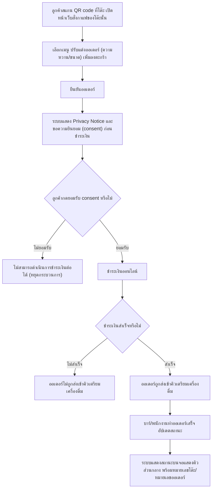

# User Journey: ลูกค้า (customer) - การสั่งกาแฟผ่าน QR ที่โต๊ะและชำระเงิน

> สร้างเมื่อ: 2026-08-15
> อ้างอิงจาก: [[../../01-requirements/01-spec/20260802-01-table-self-order-qr|20260802-01-table-self-order-qr]]

## Actor

ลูกค้าที่นั่งอยู่ที่โต๊ะในร้าน ต้องการสั่งกาแฟด้วยตนเองผ่านการสแกน QR code ที่ติดอยู่บนโต๊ะ โดยไม่ต้องลุกไปสั่งที่เคาน์เตอร์ ครอบคลุมตั้งแต่สแกน QR, เลือกเมนู, รับทราบ/ยินยอมตาม Privacy Notice ก่อนชำระเงิน, ชำระเงินออนไลน์ จนถึงการติดตามสถานะออเดอร์บนจอแสดงคิว

## แผนภาพ (Journey Flow)

## คำอธิบายขั้นตอน

1. ลูกค้าสแกน QR code เฉพาะที่ผูกกับหมายเลขโต๊ะนั้น เปิดหน้าเว็บสั่งกาแฟที่รู้ว่าออเดอร์มาจากโต๊ะไหน โดยไม่ต้องติดตั้งแอปหรือสมัครสมาชิก _(อ้างอิง: [[../../01-requirements/01-spec/20260802-01-table-self-order-qr|20260802-01-table-self-order-qr]] รายละเอียด Requirement ข้อ 1)_
2. ลูกค้าเลือกเมนู ปรับแต่งออเดอร์ (เช่น ความหวาน/ขนาด) และเพิ่มลงตะกร้าจากหน้าเว็บนี้ _(อ้างอิง: รายละเอียด Requirement ข้อ 2)_
3. ลูกค้ายืนยันออเดอร์ _(อ้างอิง: รายละเอียด Requirement ข้อ 2)_
4. ก่อนดำเนินการชำระเงินต่อ ระบบแสดงข้อความ Privacy Notice แบบสั้นกระชับ บอกวัตถุประสงค์การเก็บข้อมูล (เช่น เพื่อดำเนินการตามคำสั่งซื้อและการชำระเงิน) _(อ้างอิง: [[../../01-requirements/01-spec/20260802-03-audit-log-pdpa-consent|20260802-03-audit-log-pdpa-consent]] รายละเอียด Requirement ข้อ 5)_
5. ลูกค้าตัดสินใจว่าจะกดยอมรับ consent หรือไม่ ซึ่งเป็นขั้นตอนที่ต้องกดยอมรับก่อนจึงจะดำเนินการชำระเงินต่อได้ (active consent แบบ blocking) _(อ้างอิง: 20260802-03-audit-log-pdpa-consent รายละเอียด Requirement ข้อ 5)_
6. ถ้าลูกค้าไม่กดยอมรับ ระบบจะไม่ดำเนินการชำระเงินต่อให้ กระบวนการหยุดอยู่ที่ขั้นตอนนี้จนกว่าจะกดยอมรับ _(อ้างอิง: 20260802-03-audit-log-pdpa-consent รายละเอียด Requirement ข้อ 5)_
7. ถ้าลูกค้ากดยอมรับ ระบบให้ลูกค้าชำระเงินออนไลน์ทันทีก่อนที่ออเดอร์จะถูกส่งเข้าครัว/บาร์ (ระบบเก็บเพียงหลักฐานว่ามีการกดยอมรับ เช่น timestamp ควบคู่กับออเดอร์นั้น) _(อ้างอิง: 20260802-01-table-self-order-qr รายละเอียด Requirement ข้อ 3; 20260802-03-audit-log-pdpa-consent รายละเอียด Requirement ข้อ 6)_
8. ระบบตรวจสอบว่าการชำระเงินสำเร็จหรือไม่ — เป็นขั้นตอนที่สรุปรวมจากเงื่อนไข "ออเดอร์ที่ยังไม่จ่ายเงินจะไม่ถูกส่งเข้าคิว" _(อ้างอิง: 20260802-01-table-self-order-qr รายละเอียด Requirement ข้อ 3)_
9. ถ้าชำระเงินไม่สำเร็จ ออเดอร์จะไม่ถูกส่งเข้าคิวเตรียมเครื่องดื่ม _(อ้างอิง: 20260802-01-table-self-order-qr รายละเอียด Requirement ข้อ 3)_
10. ถ้าชำระเงินสำเร็จ ออเดอร์จะถูกส่งเข้าคิวเตรียมเครื่องดื่มทันที _(อ้างอิง: 20260802-01-table-self-order-qr รายละเอียด Requirement ข้อ 3)_
11. บาร์/พนักงานทำออเดอร์เสร็จ แล้วอัปเดตสถานะออเดอร์ในระบบ _(อ้างอิง: 20260802-01-table-self-order-qr รายละเอียด Requirement ข้อ 4)_
12. ระบบแสดงสถานะออเดอร์บนจอแสดงคิวส่วนกลางของร้าน พร้อมอ้างอิงหมายเลขโต๊ะ/หมายเลขออเดอร์ ให้ลูกค้ารู้ว่าออเดอร์ของตนพร้อมแล้ว _(อ้างอิง: 20260802-01-table-self-order-qr รายละเอียด Requirement ข้อ 4)_

## เส้นทางอื่น / กรณีพิเศษ (Edge Cases)

- กรณีชำระเงินไม่สำเร็จ แสดงเป็น decision node ในแผนภาพหลักแล้ว (ขั้นตอนที่ 8-9) — ออเดอร์จะไม่ถูกส่งเข้าคิว ลูกค้าต้องลองชำระเงินใหม่จึงจะดำเนินการต่อได้ _(อ้างอิง: เกณฑ์การยอมรับ "ออเดอร์จะไม่ถูกส่งเข้าคิวเตรียมเครื่องดื่ม จนกว่าลูกค้าจะชำระเงินออนไลน์สำเร็จ")_
- กรณีลูกค้าไม่กดยอมรับ consent แสดงเป็น decision node ในแผนภาพหลักแล้ว (ขั้นตอนที่ 5-6) — ถือเป็นทางตันของ journey นี้ เพราะระบบไม่มีวิธีให้ดำเนินการชำระเงินต่อโดยไม่ผ่าน consent _(อ้างอิง: 20260802-03-audit-log-pdpa-consent เกณฑ์การยอมรับ "ลูกค้าต้องกดยอมรับ consent ก่อนจึงจะดำเนินการชำระเงินต่อได้สำเร็จ")_
- ระบบไม่มีแอปมือถือเฉพาะของร้าน ใช้หน้าเว็บที่เปิดผ่าน QR แทนเสมอ และไม่มีระบบสมาชิก/สะสมแต้ม _(อ้างอิง: 20260802-01-table-self-order-qr หัวข้อ "ไม่ทำ")_
- ระบบไม่แจ้งเตือนเฉพาะบุคคลผ่านมือถือลูกค้าโดยตรง ใช้จอแสดงคิวส่วนกลางแทนเสมอ _(อ้างอิง: 20260802-01-table-self-order-qr หัวข้อ "ไม่ทำ")_
- ระบบไม่มีหน้า/ฟังก์ชันให้ลูกค้าถอน consent ภายหลัง — เก็บเพียงหลักฐานว่ามีการกดยอมรับแล้วเท่านั้น _(อ้างอิง: 20260802-03-audit-log-pdpa-consent หัวข้อ "ไม่ทำ")_

## เอกสารที่เกี่ยวข้อง

- [[../../01-requirements/01-spec/20260802-01-table-self-order-qr|20260802-01-table-self-order-qr]] — เอกสาร spec ต้นทางหลัก
- [[../../01-requirements/01-spec/20260802-03-audit-log-pdpa-consent|20260802-03-audit-log-pdpa-consent]] — spec รองเรื่อง Privacy Notice/PDPA consent ที่ต้องแสดงก่อนหรือระหว่างขั้นตอนชำระเงิน
