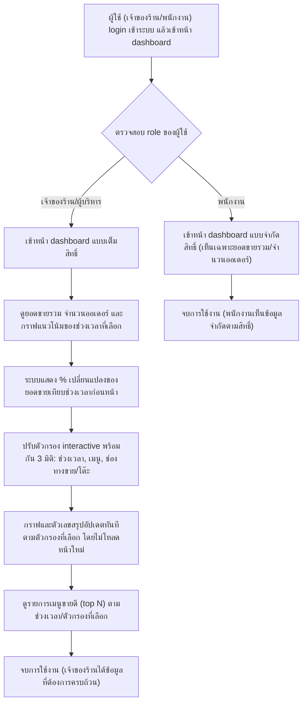

# User Journey: เจ้าของร้าน/ผู้บริหาร (owner) - การดู Sales Dashboard

> สร้างเมื่อ: 2026-08-15
> อ้างอิงจาก: [[../../01-requirements/01-spec/20260802-02-sales-dashboard|20260802-02-sales-dashboard]]

## Actor

เจ้าของร้าน/ผู้บริหารที่ต้องการติดตามภาพรวมยอดขายของร้านผ่าน dashboard แบบ interactive ครอบคลุมตั้งแต่ login เข้าดูยอดขายรวม เปรียบเทียบช่วงเวลา ใช้ตัวกรอง 3 มิติ ไปจนถึงดูเมนูขายดี รวมถึงกรณีพิเศษที่สิทธิ์การเข้าถึงข้อมูลของเจ้าของร้านต่างจากพนักงานหน้าร้าน

## แผนภาพ (Journey Flow)

## คำอธิบายขั้นตอน

1. ผู้ใช้ (เจ้าของร้าน/ผู้บริหาร หรือ พนักงานหน้าร้าน) login เข้าระบบแล้วเข้าหน้า dashboard ยอดขาย _(อ้างอิง: [[../../01-requirements/01-spec/20260802-02-sales-dashboard|20260802-02-sales-dashboard]] รายละเอียด Requirement ข้อ 1 และข้อ 5 — สรุปรวมจากทั้งสองข้อที่ระบุการเข้าถึงของทั้งสอง role)_
2. ระบบตรวจสอบ role ของผู้ใช้ที่ login เข้ามา เพื่อกำหนดสิทธิ์การเข้าถึงข้อมูลใน dashboard ให้ต่างกันตาม role _(อ้างอิง: รายละเอียด Requirement ข้อ 5)_
3. ถ้าเป็นเจ้าของร้าน/ผู้บริหาร ระบบให้เข้าหน้า dashboard แบบเต็มสิทธิ์ เห็นข้อมูลทั้งหมดและตัวกรองครบทุกมิติ _(อ้างอิง: รายละเอียด Requirement ข้อ 5)_
4. ถ้าเป็นพนักงานหน้าร้าน ระบบให้เข้าหน้า dashboard ได้ แต่เห็นเฉพาะยอดขายรวมและจำนวนออเดอร์ (พร้อมตัวกรองช่วงเวลาเท่านั้น) ไม่เห็นตัวกรองตามเมนู/ช่องทาง และไม่เห็นข้อมูลเชิงลึกอื่น _(อ้างอิง: รายละเอียด Requirement ข้อ 5)_
5. เจ้าของร้านดูยอดขายรวม (บาท), จำนวนออเดอร์ทั้งหมด และกราฟแนวโน้มยอดขาย โดยเลือกช่วงเวลาได้ (วันนี้/สัปดาห์นี้/เดือนนี้/กำหนดช่วงวันที่เอง) _(อ้างอิง: รายละเอียด Requirement ข้อ 1)_
6. ระบบคำนวณและแสดงเปอร์เซ็นต์การเปลี่ยนแปลงของยอดขายเทียบกับช่วงเวลาก่อนหน้าที่มีระยะเวลาเท่ากัน (เช่น สัปดาห์นี้เทียบสัปดาห์ที่แล้ว) _(อ้างอิง: รายละเอียด Requirement ข้อ 2)_
7. เจ้าของร้านปรับตัวกรองแบบ interactive ได้พร้อมกันตาม 3 มิติ: ช่วงเวลา, เมนูใดเมนูหนึ่งหรือทุกเมนู, และช่องทางขาย/โต๊ะใดโต๊ะหนึ่งหรือทุกช่องทาง (รวมออเดอร์จาก QR self-order ที่โต๊ะด้วย) _(อ้างอิง: รายละเอียด Requirement ข้อ 4 และข้อ 6)_
8. เมื่อปรับตัวกรองใด ๆ กราฟและตัวเลขสรุปทั้งหมดในหน้าคำนวณและแสดงผลใหม่ให้ตรงกับตัวกรองที่เลือกทันที โดยไม่ต้องโหลดหน้าใหม่ _(อ้างอิง: รายละเอียด Requirement ข้อ 4)_
9. เจ้าของร้านดูรายการเมนูขายดีอันดับต้น ๆ (top N) ในช่วงเวลา/ตัวกรองที่เลือก โดยอ้างอิงจากจำนวนที่ขายได้ _(อ้างอิง: รายละเอียด Requirement ข้อ 3)_
10. จบการใช้งานของเจ้าของร้าน โดยได้ข้อมูลยอดขาย แนวโน้ม และเมนูขายดีตามที่ต้องการครบถ้วน _(อ้างอิง: รายละเอียด Requirement ข้อ 1-4, 6 — สรุปรวมผลลัพธ์ปกติของการใช้งานแบบเต็มสิทธิ์)_
11. จบการใช้งานของพนักงาน โดยเห็นเฉพาะยอดขายรวมและจำนวนออเดอร์ตามสิทธิ์ที่จำกัดไว้ _(อ้างอิง: รายละเอียด Requirement ข้อ 5)_

## เส้นทางอื่น / กรณีพิเศษ (Edge Cases)

- สิทธิ์การเข้าถึงข้อมูลที่ต่างกันระหว่างเจ้าของร้านและพนักงาน แสดงเป็น decision node ในแผนภาพหลักแล้ว (ขั้นตอนที่ 2-4) — เป็นกรณีพิเศษหลักที่ระบุไว้ชัดเจนใน spec _(อ้างอิง: เกณฑ์การยอมรับ "ผู้ใช้ที่มีสิทธิ์พนักงานเข้าหน้า dashboard ได้ แต่เห็นเฉพาะยอดขายรวมและจำนวนออเดอร์...")_
- ระบบไม่แสดงข้อมูลต้นทุนวัตถุดิบและกำไรสุทธิ เนื่องจากยังไม่มี requirement เรื่องข้อมูลต้นทุนวัตถุดิบในระบบ _(อ้างอิง: หัวข้อ "ไม่ทำ" ข้อ "การคำนวณต้นทุนวัตถุดิบและกำไรสุทธิ")_
- ระบบไม่รองรับการแยกยอดขายตามสาขา และไม่มีฟังก์ชัน export รายงานเป็นไฟล์ (Excel/PDF) หรือการแจ้งเตือนสรุปยอดขายผ่านช่องทางอื่น (เช่น LINE, email) ในเวอร์ชันนี้ _(อ้างอิง: หัวข้อ "ไม่ทำ")_

## เอกสารที่เกี่ยวข้อง

- [[../../01-requirements/01-spec/20260802-02-sales-dashboard|20260802-02-sales-dashboard]] — เอกสาร spec ต้นทาง
- [[../../01-requirements/01-spec/20260802-01-table-self-order-qr|20260802-01-table-self-order-qr]] — แหล่งข้อมูลออเดอร์ส่วนหนึ่งที่ dashboard นี้นับรวมยอดขาย
- [[../../01-requirements/01-spec/20260802-03-audit-log-pdpa-consent|20260802-03-audit-log-pdpa-consent]] — audit log ที่บันทึกการ login และการเข้าถึงหน้า dashboard ตามสิทธิ์ role
